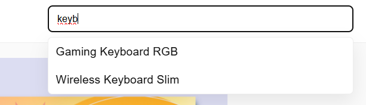
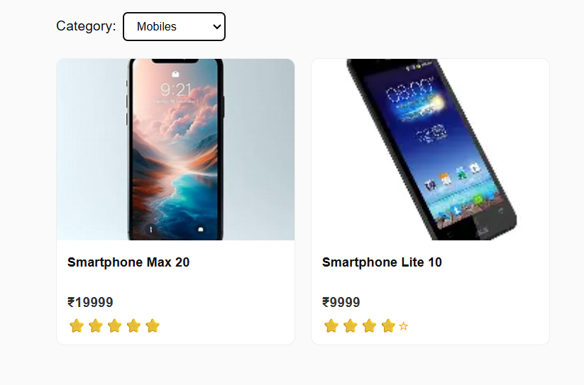
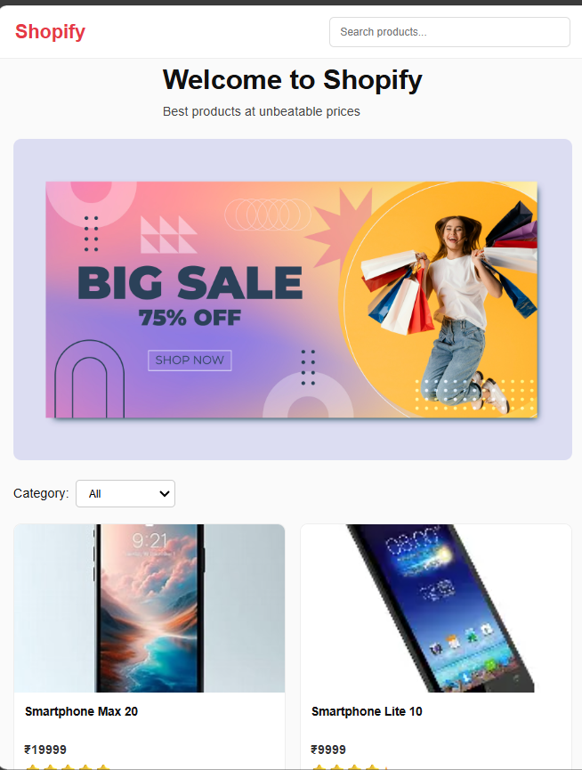
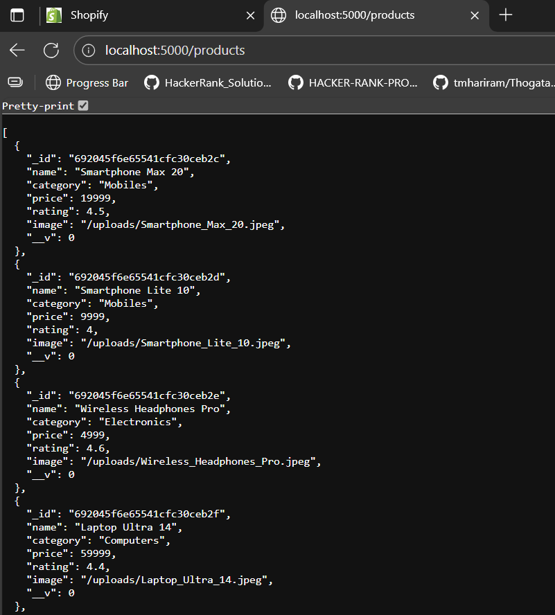

# MERN Product Landing Page — Assignment Submission

This project is a responsive MERN-stack Product Landing Page built as part of the Trizen Ventures recruitment assignment.  
It includes a React frontend, Node/Express backend, MongoDB data storage, and a functional search autosuggest feature.

---

## 🚀 Features

### 🔍 Search + Autosuggest
- Shows up to **5 suggestions**
- Case-insensitive partial search
- Clicking a suggestion fills the search bar

### 🛒 Product Listing
- 20 sample products with real image URLs
- Displays:
  - Name
  - Price
  - Rating (⭐)
  - Category
- Hover animations & clean card UI

### 🔽 Filters
- Category filter (dynamic based on data)

### 📱 Fully Responsive
- Desktop
- Tablet
- Mobile

### 🗄 Backend API
- `GET /products` → Returns all products
- `GET /products/search?q=` → Autosuggest search (max 5)
- MongoDB + Mongoose

---

## 📁 Project Structure

```

/backend        → Node.js + Express API
/frontend       → React app
/screenshots    → UI screenshots (desktop + mobile)
/README.md
/.gitignore

````

---

## ⚙️ Setup Instructions

### 1️⃣ Backend Setup

1. Open terminal:
   ```bash
   cd backend
   npm install
   ````

2. Create `.env` file:

   ```
   MONGO_URI=your_mongodb_connection_string
   PORT=5000
   ```

3. Seed sample products:

   ```bash
   npm run seed
   ```

4. Start backend:

   ```bash
   npm run dev
   ```

Backend runs at:
👉 `http://localhost:5000`

---

### 2️⃣ Frontend Setup

1. Open a second terminal:

   ```bash
   cd frontend
   npm install
   npm start
   ```

Frontend runs at:
👉 `http://localhost:3000`

---

## 🖼 Screenshots

### 🔹 Homepage


### 🔹 Search Autosuggest



### 🔹 Product Grid



### 🔹 Filters


### 🔹 Mobile View



### 🔹 Endpoints




---

## 🎥 Demo Video (1–2 minutes)

The recorded demo includes:

* Backend running & database seeded
* Frontend UI loading successfully
* Searching with autosuggest
* Clicking suggestions
* Filtering by category
* Responsive behaviour shown (resize window)


Click the link below to view the demo video:

👉 **[Watch Demo Video](https://shorturl.at/J79GW)**

---


## 📞 Contact

**Mobile:** +91 8341300541
**Email:** [tmhariram@gmail.com](mailto:tmhariram@gmail.com)

---

## 🙌 Thank You

Thank you for reviewing my assignment.
